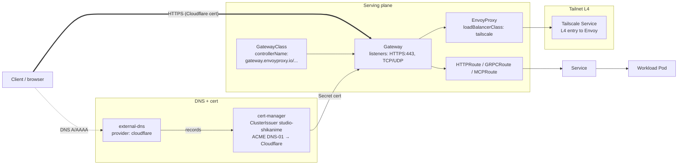
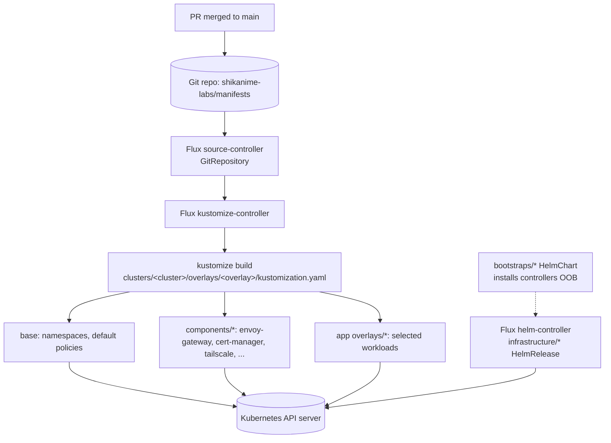
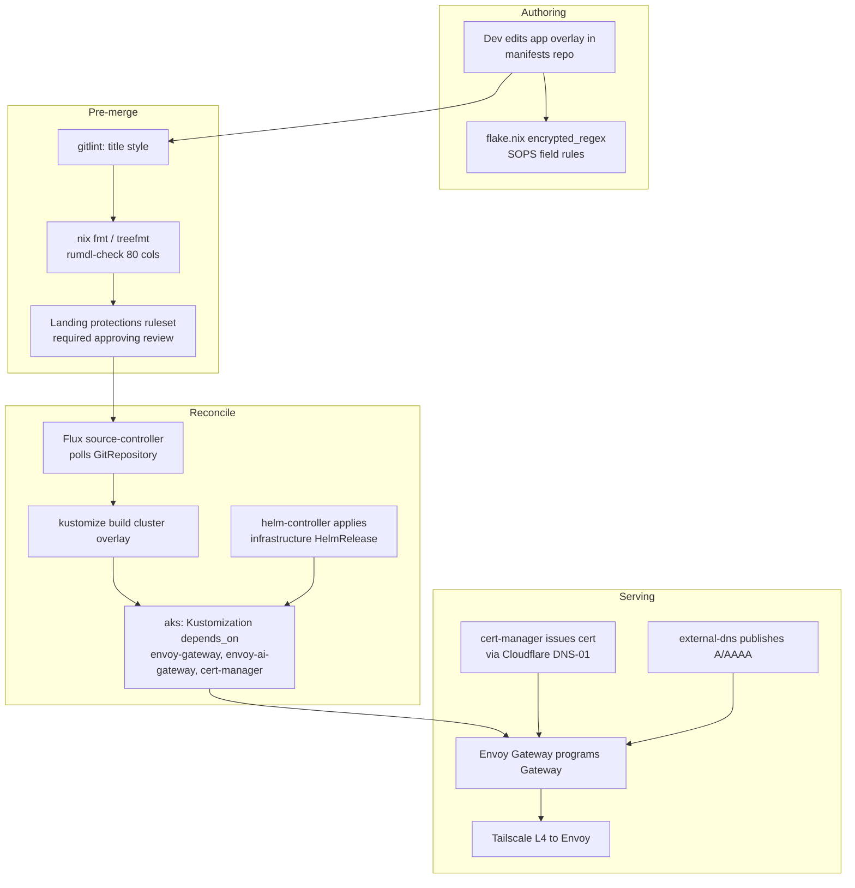

<!-- owner: shikanime platform team | zone: internal | purpose: architecture intent, serving model, reconciliation flow, and migration state -->

# Architecture

This repository is the declarative source of truth for the Shikanime
Kubernetes clusters. Flux reconciles the manifests into live state; Kustomize
composes per-cluster variants from shared bases. Nothing in a cluster is
hand-edited — every change flows through a PR here.

A hand-drawn topology diagram lives alongside this page:
[`architecture.excalidraw`](./architecture.excalidraw).

## Serving model — the migration

The org is moving its primary ingress from **Tailscale Ingress**
(`ingressClassName: tailscale`) to **Gateway API** (Envoy Gateway + EnvoyProxy),
with Tailscale demoted to an L4 `LoadBalancerClass` on the Envoy data plane, and
public certificates issued via Cloudflare DNS-01 by cert-manager, published by
external-dns. The diagram below shows the *target* shape (and which apps are
already there).

**Why the change.** Gateway API gives portable, route-level policy (per-route
auth, traffic, security policies) instead of one Ingress per app; the Envoy
data plane is a single managed proxy per app rather than N Tailscale proxies.
Tailscale stays as the private L4 transport (mTLS, no public exposure) while
Cloudflare + external-dns own the public DNS/cert surface.

### Migrated app pattern

A migrated app carries four resources in its `overlays/<cluster>-tailnet/`:

- `gatewayclass.yaml` — `GatewayClass`,
  `controllerName: gateway.envoyproxy.io/gatewayclass-controller`,
  `parametersRef` → the app's `EnvoyProxy` in `shikanime`.
- `gateway.yaml` — `Gateway` with `gatewayClassName: <app>` and listeners
  (HTTPS:443 terminating a cert `Secret`; optional TCP/UDP for non-HTTP apps).
- `httproute.yaml` — `HTTPRoute`/`GRPCRoute` with `parentRefs` to the Gateway
  and `rules` to the app `Service`.
- `envoyproxy.yaml` — `EnvoyProxy` whose `envoyService` is a `LoadBalancer`
  with `loadBalancerClass: tailscale` (Tailscale hostname/tag annotations).

Verified example: `apps/syncthing/overlays/nishir-tailnet/`
(`gatewayclass.yaml`, `gateway.yaml`, `envoyproxy.yaml`,
`patch-httproute.yaml`), cert from `studio-shikanime`.

### Migration state (current)

Census of `apps/` (authoritative; counted by resource files, not annotations):

| State | Count | Apps |
| ----- | ----- | ---- |
| **Gateway API + Tailscale L4** (target end-state) | 5 | `bazarr`, `copyparty`, `llama-cpp`, `synapse`, `syncthing` |
| **Legacy Tailscale Ingress** (`ingressClassName: tailscale`) | 24 | `authelia`, `forgejo`, `gitea-mirror`, `hermes-agent`, `honcho`, `immich`, `jellyfin`, `metatube`, `prowlarr`, `qbittorrent`, `seerr`, `vaultwarden`, `servarr/*` (lidarr, radarr, sonarr, whisparr), `mautrix/*` (discord, googlechat, linkedin, meta, signal, slack, twitter, whatsapp) |
| **Tailscale L4 Service only** (`loadBalancerClass: tailscale`) | 1 | `catbox` (plus `qbittorrent` exposes a tracker LB) |
| **No public serving** (internal / DB / cache) | 6 | `lldap`, `honcho-postgres`, `immich-postgres`, `immich-ml`, `immich-valkey` |

> Migration is **nishir-only**. `telsha` has no `envoy-gateway`, `external-dns`,
> or Cloudflare issuer — it stays on legacy Tailscale ingress. Each migrated
> app owns a *per-app* `GatewayClass`/`EnvoyProxy`; there is no shared cluster
> Gateway.

## Repository layout

The tree separates *what runs an app* from *what the platform provides* from
*how operators are installed*. Files are YAML; within each tree every resource
manifest is named `<short-kube-resource-name>.yaml` (e.g. `sts.yaml`,
`svc.yaml`, `vpa.yaml`, `hr.yaml`, `netpol.yaml`).

| Directory       | Role                                                          |
| --------------- | ------------------------------------------------------------- |
| `apps/`         | Application workloads. One directory per app.                 |
| `infrastructure/` | Per-operator platform deployments (mostly Flux `HelmRelease`). |
| `configs/`      | Global operator-dependent config not tied to one app.        |
| `modules/`      | Reusable Kustomize/Terraform modules shared across trees.     |
| `clusters/`     | Entrypoints composing cluster base + components + app overlays. |
| `bootstraps/`   | Out-of-band controller/operator installation (Flux `HelmChart`). |

### Application pattern (`apps/`)

Each app follows `base/` + `components/` + `overlays/<cluster>/`:

- `apps/<app>/base/` — common resources: `Deployment`/`StatefulSet`, `Service`,
  `Ingress` (legacy) or `vpa.yaml`, `pvc.yaml` as needed.
- `apps/<app>/components/` — optional Kustomize components (e.g. `tls/`).
- `apps/<app>/overlays/<cluster>/` — cluster-specific patches, the Gateway-API
  serving resources, and a PVC bound to a Longhorn PV.

Every app base carries a `vpa.yaml` — the VPA controller must be present.

### Infrastructure pattern (`infrastructure/`)

One directory per operator. `base/` holds `helmrepo.yaml`, the `*hr.yaml`
(`HelmRelease`), `ns.yaml`, and `vpa.yaml`; `components/monitoring/` adds scrape
config. Serving-relevant operators:

| Operator | Chart / version | Namespace | Role |
| -------- | --------------- | --------- | ---- |
| `envoy-gateway` | `gateway-helm` `v1.9.0` | `envoy-gateway-system` | Envoy Gateway control plane; wires the ai-gateway xDS hook |
| `envoy-ai-gateway` | ai-gateway `1.1.0` | `envoy-ai-gateway-system` | Inference extension (ext-proc filter bundle) |
| `cert-manager` | cert-manager | `cert-manager` | Issuers + certificates |
| `external-dns` | `external-dns` `1.21.1` | `external-dns-system` | Cloudflare DNS records |
| `trust-manager` | trust-manager | `trust-manager` | CA `Bundle` distribution |

### Global config (`configs/`)

`configs/<area>/base/` holds shared resources — storage classes, issuers,
Gatekeeper mutations. Cluster overlays patch them. Key serving config:

- `configs/cert-manager/overlays/nishir/clusterissuer.yaml` — three
  `ClusterIssuer`s: `nishir-selfsigned` (bootstrap root), `nishir` (internal CA
  from `nishir-ca`), and `studio-shikanime` (**Let's Encrypt ACME, DNS-01 via
  Cloudflare**, `cloudflare-api-token` secret).
- `configs/cert-manager/overlays/{nishir,telsha}/bundle.yaml` — trust-manager
  `Bundle`s consumed by Gatekeeper mutations and Gateway `BackendTLSPolicy`.

## GitOps reconciliation flow

## Operational workflow and dependencies

How a change moves through the org, and what each stage depends on:

**Cross-tree dependency order** (Flux `Kustomization.dependsOn`,
`clusters/nishir/components/external-dns/ks.yaml`):

1. `infrastructure-envoy-gateway` and `infrastructure-envoy-ai-gateway` must be
   `Ready` (the Gateway API CRDs + xDS hook exist).
2. `config-cert-manager` must be `Ready` (the `studio-shikanime` issuer and
   trust `Bundle` exist).
3. Only then `infrastructure-external-dns` reconciles (it needs the Gateway API
   - cert-manager to publish records).

**Cross-organization dependencies:**

- **Cloudflare** — DNS zone (`shikanime.studio`, `i.shikanime.studio`) and
  ACME DNS-01 solver (`cloudflare-api-token` SOPS secret). No Cloudflare, no
  public cert, no external-dns records.
- **Tailscale** — the `tailscale` operator and `tag:*` ACLs own the L4
  transport; the Envoy `EnvoyProxy` `LoadBalancer` is a Tailscale device.
- **GitHub** — `shikanime-labs/manifests` (this repo) is the source of truth;
  `Landing protections` ruleset gates `main`. `shikanime-labs/machines` carries
  the NixOS fleet that runs the clusters; node hostnames and tailnet FQDNs are
  the join surface.
- **Shikanime Studio (Google Cloud)** — `architecture.excalidraw` shows
  backups land in a Studio GCS bucket; backup jobs are Longhorn recurring jobs
  / runbook procedures, not part of the serving graph.

## Clusters

Two clusters, both on the `tailnet` overlay:

| Cluster | Serving capability | Distinct components |
| ------- | ------------------ | ------------------- |
| `nishir` | Gateway API + Tailscale L4 + Cloudflare | autoscaler, cert-manager, cluster-api, descheduler, envoy-gateway, envoy-ai-gateway, external-dns, gatekeeper, kubevirt, longhorn, lws, node-feature-discovery, tailscale, trust-manager, victoria-logs, victoria-metrics |
| `telsha` | Legacy Tailscale Ingress only | autoscaler, cert-manager, cluster-api, gatekeeper, tailscale, trust-manager, victoria-logs, victoria-metrics |

`nishir` carries the heavier capability set (AI gateway, kubevirt, longhorn,
external-dns). `telsha` is the lighter node and has not begun the migration.

## Cross-cutting platform services

- **TLS / trust:** cert-manager (`studio-shikanime` Cloudflare DNS-01 for
  public, `nishir` CA for internal) plus a trust-manager `Bundle` distributing
  the CA across workloads and Gateway `BackendTLSPolicy`.
- **Serving:** Envoy Gateway is primary (Gateway API); Tailscale is the L4
  transport behind it; legacy apps still use Tailscale Ingress.
- **Storage:** Longhorn provides the storage class, settings, and recurring
  jobs; app PVCs bind to Longhorn volumes (`nishir-standard`, `nishir-capacity`
  cold tier).
- **Observability:** VictoriaMetrics + VictoriaLogs + Grafana, exposed over
  Tailscale.
- **Inference:** `apps/llama-cpp/*` router workloads behind an Envoy AI Gateway
  `AIGatewayRoute`, exposed over Tailscale BYOD L4 to preserve mTLS client
  certs end-to-end.

## Secrets and trust model

The repo is open-source: SOPS encrypts **only selected fields**, never whole
files. Per-app `encrypted_regex` rules (in `flake.nix`) match the keys that
become ciphertext; the rest stays plaintext. Encrypted files use the `*.enc.*`
pattern (e.g. `.enc.env`, `config.enc.yaml`) and live in a subfolder named
after the secret. Flux decrypts them transparently via its SOPS integration at
reconcile time — no manual filename stripping is committed. Never commit a
decrypted output; change the encrypted source instead.

## Operational knowledge

Failure-mode recovery and on-call procedures live under
[`runbooks/`](./runbooks/): Longhorn volume recovery, NFS recovery, kubevirt
VM restart-required Flux health, and related procedures.

## Change conventions

- Plain-text capitalized commit title, no conventional-commit prefix.
- Body with optional `Design:` / `Related:` / `Closes #` labels; wrap Markdown
  at 80 columns and run `nix fmt` (treefmt) before shipping.
- `main` is protected by the `Landing protections` ruleset (required approving
  review, code-owner review) — changes land via PR, not direct push.

See `AGENTS.md` for the full convention reference.
